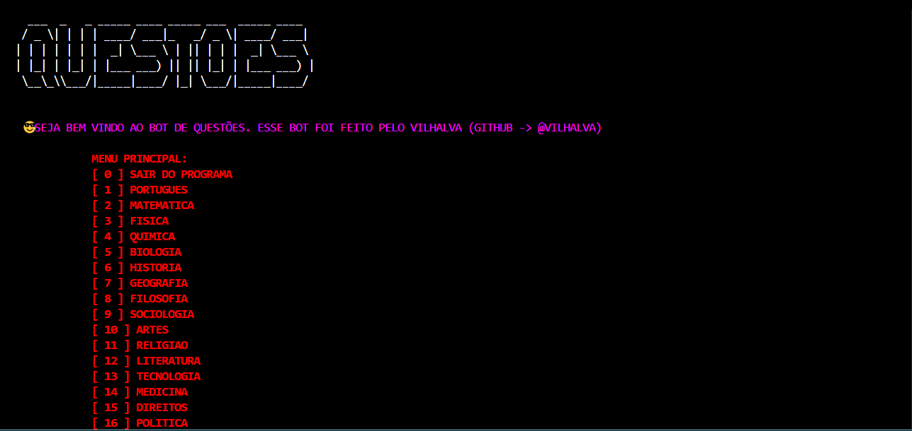
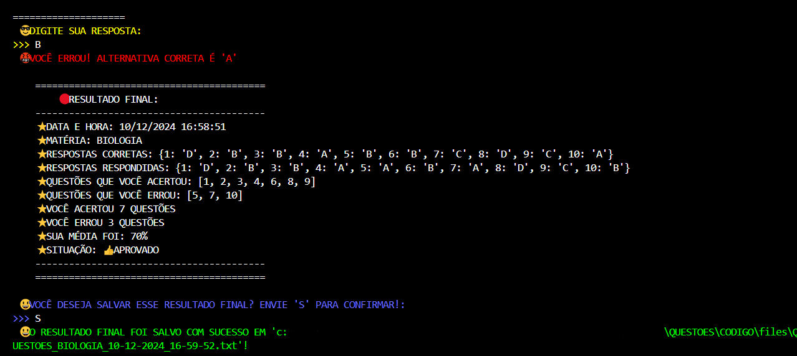
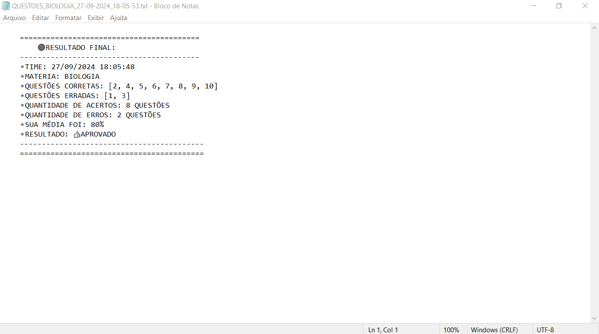

# QUESTOES
👨‍💻QUESTÕES É UM BOT DE SIMULADOR DE ENEM QUE RODA NO CONSOLE DA IDE.

 <br>
 <br>
 <br>

## DESCRIÇÃO:
O Bot é um quiz interativo que apresenta perguntas sobre uma matéria específica. A seguir, uma descrição resumida de suas funcionalidades:

1. **Menu Principal:** O usuário pode escolher entre mais de 50 matérias disponíveis.

2. **Boas-Vindas:** O bot saúda o jogador e informa sobre a matéria em questão.

3. **Perguntas:** O usuário recebe uma série de perguntas relacionadas à matéria selecionada.

4. **Respostas:** O bot aceita respostas (A, B, C ou D) para cada pergunta.

5. **Feedback:** Fornece retorno imediato sobre a correção das respostas.

6. **Resultado Final:** Ao término do quiz, são exibidas estatísticas que incluem o nome da matéria, o time, questões corretas, questões erradas, quantidade de acertos, quantidade de erros, média de acertos, e a aprovação ou reprovação do jogador com base em uma porcentagem mínima de acertos.

7. **Salvar Resultado Final:** O sistema perguntará se o usuário deseja salvar as informações. Se afirmativo, o resultado será salvo em um arquivo `.txt` no diretório `./CODIGO/files`, com o nome `QUESTOES_{MATERIA}_{TIME}.txt`, contendo os mesmos dados exibidos no console.

## EXECUTANDO O PROJETO:
1. **Instalar as dependências**:
   - Antes de rodar o bot, é essencial garantir que todas as dependências estejam instaladas. No terminal, navegue até o diretório `CODIGO` e execute o seguinte comando para instalar os pacotes listados no arquivo `requirements.txt`:
     ```bash
     pip install -r requirements.txt
     ```

2. **Execute o programa:**
   - Para iniciar o programa, execute o comando abaixo:
   ```bash
   python main.py
   ```

3. **Interação com o menu principal:**
   - Assim que o bot iniciar, você verá um menu principal no console com várias matérias numeradas.
   - Leia as matérias disponíveis e digite o número correspondente à matéria que deseja responder.

4. **Escolha da Matéria:**
   - O bot executará a matéria que você selecionou.
   - Responda às perguntas corretamente, enviando apenas uma das opções: `A`, `B`, `C` ou `D`.
   - Após apresentar o `RESULTADO FINAL`, o bot perguntará se você deseja salvar as informações. Envie `S` para confirmar ou qualquer outro caractere para recusar.

5. **Retorno ao menu principal:**
   - Após a execução de cada materia, o bot retornará automaticamente ao menu principal, permitindo que você escolha outra materia ou opte por sair.

6. **Saindo do programa:**
   - Quando desejar encerrar o programa, digite `0` no menu principal. Isso encerrará o bot de forma segura.

## NÃO SABE?
- Entendemos que para manipular arquivos em muitas linguagens e tecnologias, é necessário possuir conhecimento nessas áreas. Para auxiliar nesse aprendizado, oferecemos cursos gratuitos disponíveis:
* [CURSO DE PYTHON](https://github.com/VILHALVA/CURSO-DE-PYTHON)
* [CONFIRA MAIS CURSOS](https://github.com/VILHALVA?tab=repositories&q=+topic:CURSO)

## CREDITOS E MAIS:
- [PROJETO CRIADO PELO VILHALVA](https://github.com/VILHALVA)
- [CLIQUE AQUI PARA VER O HISTÓRICO DE ATUALIZAÇÕES](./UPDATES.md)
