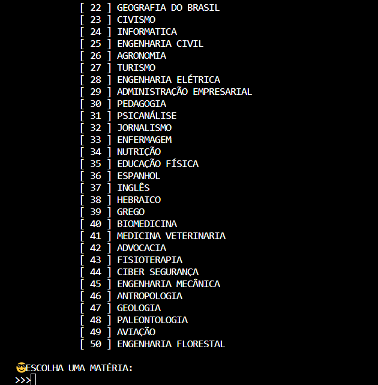

# QUESTOES
👨‍💻QUESTÕES É UM APP DE SIMULADOR DE ENEM QUE RODA NO CONSOLE DA IDE.

  

## DESCRIÇÃO:
O programa é um quiz interativo que apresenta perguntas sobre uma matéria específica. Aqui está uma descrição mais concisa:

1. **Menu principal:** O usuário poderá escolher mais de 20 matérias.

2. **Boas-vindas:** Sauda o jogador e informa sobre a matéria das perguntas.

3. **Perguntas:** Apresenta uma série de perguntas ao usuário.

4. **Respostas:** Aceita as respostas do usuário (A, B, C ou D) para cada pergunta.

5. **Feedback:** Fornece feedback imediato sobre a correção da resposta.

6. **Resultado Final:** Ao final, exibe estatísticas, incluindo questões corretas, questões erradas, quantidade de acertos, quantidade de erros, média de acertos e determina se o jogador foi aprovado ou reprovado com base em uma porcentagem mínima de acertos.

## SAIBA MAIS:
- [CLIQUE AQUI PARA VER O HISTÓRICO DE ATUALIZAÇÕES](./UPDATES.md)
- [PROJETO CRIADO PELO VILHALVA](https://github.com/VILHALVA)
- [FAÇA OS NOSSOS CURSOS](https://github.com/VILHALVA?tab=repositories&q=+topic:CURSO)
